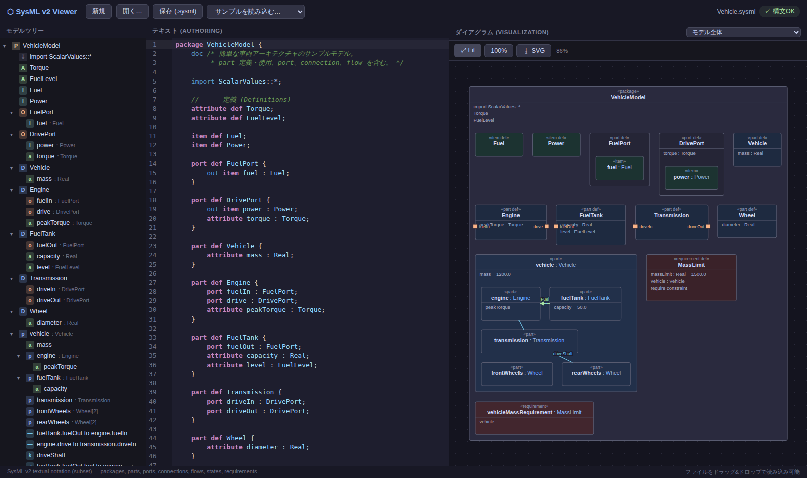

# SysML v2 Viewer (VS Code 拡張)

SysML v2(`.sysml` / `.kerml`)のオーサリングと可視化を行う VS Code 拡張です。
[SysIDE](https://sensmetry.com/syside/) と同様の「言語サポート + ダイアグラム」構成で、
エディタ・ファイル管理・リモート開発は VS Code 本体の機能をそのまま活用します。



## 機能

### 言語サポート(Authoring)
- シンタックスハイライト(TextMate 文法)
- リアルタイム構文診断(「問題」パネル・波線表示)
- **意味検証**(SysIDE 相当の診断層):
  - 未解決参照(型・特化・再定義・connect / flow の端・遷移先・メタデータ等)
  - 同一スコープ内の重複名
  - 型付け / 特化の種類整合(part は part def で型付けする 等)
  - スコープ・import(非推移)・型/特化の継承メンバーを考慮した名前解決
  - 診断レベルは設定 `sysml.validation.*` で error / warning / off に変更可能
- **標準ライブラリの最小サブセットを同梱**: `ScalarValues`(Real 等)/ `ISQ` /
  `SI` / 基本 def 群が import で解決し、F12 で同梱ライブラリへジャンプ可能
- 補完: キーワード / スニペット(`part def` `transition` `connect` など)/
  **ワークスペース全ファイルの要素名**
- アウトライン(階層シンボル表示、パンくずリスト対応)
- **定義へ移動**(F12): ファイル横断で型・要素の宣言へジャンプ
- ホバー: 要素の種別・限定名・型・`doc` コメントを表示

### ダイアグラム(Visualization)
- エディタタイトルの図アイコン、またはコマンド「SysML: ダイアグラムを開く」
- ワークスペースの **全 `.sysml` を結合した単一モデル**を描画
  (ファイルをまたぐ `import` / 参照が解決されます)
- part のネストボックス・port・`connect` / `flow` / `bind` の接続線、
  状態機械の遷移矢印、アクションの succession を SVG で描画
- パン / ズーム / Fit / SVG エクスポート
- 図ルートの切り替え(モデル全体 / 特定の package・part など)
- **エディタと双方向同期**: 図の要素クリック → 該当ソースへジャンプ、
  エディタのカーソル移動 → 図の要素をハイライト
- 編集すると図は自動で追従更新
- **図からのモデル編集**(テキストへ書き戻し、アンドゥは VS Code 標準):
  - 「⌁ 接続」: 2 要素を順にクリック → 適切なスコープに `connect a to b;` を挿入
  - 「+part / +port / ...」: コンテナをクリックして要素を追加(名前を入力)
  - ダブルクリックで宣言名のリネーム、Delete キーで要素削除
- **配置の保存**: トップレベルのボックスはドラッグで自由に配置でき、
  位置はワークスペースの `.sysml-layout.json`(サイドカー)に自動保存。
  SVG エクスポートと合わせて drawio の手作業を置き換え可能

### マルチファイル / リモート
- ワークスペース内の `.sysml` / `.kerml` を自動インデックス(追加・変更・削除を監視)
- リモートのプロジェクトは **Remote-SSH / WSL / Dev Containers** でそのまま動作

## インストール

```bash
npm install
npm run package        # sysml-v2-viewer-<version>.vsix を生成
code --install-extension sysml-v2-viewer-0.3.0.vsix
```

開発時は VS Code でこのリポジトリを開いて F5(`samples/` を開いた
拡張開発ホストが起動します)。

## 対応している SysML v2 テキスト記法(サブセット)

`package` / `part def` / `part` / `attribute` / `port` / `item` / `action` /
`state` / `transition` / `requirement` / `constraint` / `interface` /
`connection` / `connect` / `bind` / `flow` / `import` / `alias` / `doc` /
`enum` / `use case` / `perform` / `exhibit` / `satisfy` /
`@Metadata` 注釈 / `#metadata` プレフィックス / `filter` / `individual def` /
特化 (`:>`, `specializes`, `subsets`) / 再定義 (`:>>`, `redefines`) /
多重度 (`[n..m]` + `ordered` / `nonunique`) / 値 (`= expr`) /
方向 (`in` / `out` / `inout`) など。
未対応の構文はエラー回復しながら読み飛ばすため、部分的なモデルでも動作します。

## 構成

```
syntaxes/sysml.tmLanguage.json   # TextMate 文法 (ハイライト)
language-configuration.json      # コメント・括弧・インデント設定
src/
├── core/                # エディタ非依存のコア
│   ├── lexer.ts         #   トークナイザ
│   ├── parser.ts        #   再帰下降パーサ (エラー回復付き)
│   ├── ast.ts           #   簡易 AST
│   ├── layout.ts        #   ダイアグラムレイアウト
│   └── serialize.ts     #   webview への AST 受け渡し
├── extension/           # 拡張ホスト側
│   ├── extension.ts     #   エントリポイント
│   ├── modelIndex.ts    #   ワークスペース全体のモデルインデックス
│   ├── languageFeatures.ts  # 診断・補完・シンボル・定義・ホバー
│   └── diagramPanel.ts  #   ダイアグラム Webview パネル
└── webview/             # Webview (React + SVG)
    ├── DiagramApp.tsx   #   メッセージング・ルート選択
    └── DiagramView.tsx  #   SVG 描画 (パン/ズーム)
samples/                 # サンプルモデル (複数ファイル構成の例を含む)
test/                    # 拡張ホスト統合テスト (@vscode/test-electron)
```

## テスト

```bash
npm run check            # 型チェック
npm run build            # バンドル (esbuild)
node test/runTest.mjs    # VS Code をダウンロードして統合テストを実行
```

## 制限事項

- パーサは OMG SysML v2 仕様の実用的なサブセットです(KerML 固有層の
  classifier / feature 等は未対応)。式(constraint / calc の本体)は
  不透明テキストとして扱い、式の型チェックは行いません
- 名前解決はスコープ・import(非推移)・継承メンバーを考慮した近似実装です。
  可視性(private / protected)は強制しません
- 同梱の標準ライブラリは最小サブセットです(完全な OMG ライブラリではありません)
- 図のリネームは宣言名のみ変更します(参照箇所は追従しません)
